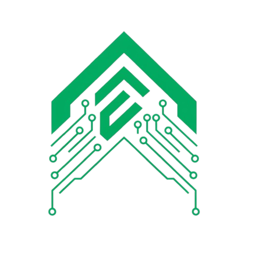

# Echelon Ascent 🧠⚡

<div align="center">
  
  
  **Neural Augmentation Academy • Cyberpunk Web3 Gaming Platform**
  
  [](https://nextjs.org/)
  [](https://convex.dev/)
  [](https://solana.com/)
  [](https://www.typescriptlang.org/)
  [](https://tailwindcss.com/)
</div>

---

## 🌟 Overview

**Echelon Ascent** is an immersive cyberpunk-themed neural augmentation academy where players train as augmented agents in a dystopian future. Built on cutting-edge Web3 technology, players enhance their cognitive abilities, complete complex missions, and compete in a real-time leaderboard system—all while earning blockchain-based rewards.

### 🎯 Vision

*"In 2087, neural augmentation isn't just an advantage—it's survival. Welcome to Echelon Academy, where ordinary minds are forged into extraordinary weapons."*

---

## ✨ Key Features

### 🧠 **Neural Augmentation System**
- **Progressive Enhancement Trees**: Upgrade Accuracy, Reflex, and Cognition with scaling costs
- **Dynamic Stat Scaling**: Real-time ability calculations with performance bonuses
- **Visual Progress Tracking**: Animated capability matrices with neural network aesthetics
- **Smart Upgrade Validation**: Level-gated enhancements with requirement checking

### 🎯 **Advanced Mission System**
- **Dynamic Mission Generation**: 20+ unique mission types with varying difficulties
- **Real-time Requirement Checking**: Smart mission gating based on player stats
- **Performance-Based Rewards**: Efficiency bonuses (90%+, 95%+ thresholds)
- **First Clear Bonuses**: 50% extra rewards for mission completion pioneers
- **Mission Progress Simulation**: Variable-speed progress based on difficulty

### 🏆 **Comprehensive Leaderboards**
- **Multiple Ranking Categories**: Overall, Level, Mission Masters, Credit Leaders, Precision Elite, Reflex Champions, Cognitive Masters
- **Real-time Rankings**: Live updates with trend indicators (📈📉➖)
- **Interactive Features**: Category switching, player profiles, achievement showcases
- **Competitive Analytics**: Performance metrics across all categories

### 👤 **Enhanced Augmentee Profiles**
- **Neural Overview Dashboard**: Real-time stats, level progression, rank badges
- **Equipment Management**: Comprehensive loadout system with rarity integration
- **Achievement System**: 15+ dynamic achievements across multiple categories
- **Analytics Dashboard**: Performance metrics, capability breakdowns, mission statistics

### 🛒 **Marketplace Integration**
- **Equipment Trading**: Buy/sell augmentation gear and consumables
- **Dynamic Pricing**: Market-driven economy with supply/demand mechanics
- **Inventory Management**: Comprehensive item tracking and organization
- **Rarity Systems**: Common, Rare, Epic, Legendary item classifications

### 🎮 **Training Systems**
- **Skill-based Drills**: Accuracy, reflex, and cognitive training modules
- **Performance Tracking**: Detailed analytics and improvement metrics
- **Leaderboard Integration**: Training performance affects global rankings
- **Progressive Difficulty**: Adaptive training that scales with player ability

### 💰 **Blockchain Integration**
- **ASCENT Token**: Native SPL token with on-chain/off-chain hybrid system
- **Solana Web3 Integration**: Civic wallet authentication and management
- **Token Rewards**: Earn ASCENT tokens through gameplay achievements
- **NFT Drops**: Rare equipment and achievements as collectible NFTs

---

## 🚀 Technology Stack

### **Frontend**
- **Framework**: Next.js 15.2.3 with React 19
- **Styling**: Tailwind CSS 4 with custom cyberpunk themes
- **UI Components**: Lucide React icons, custom neural animations
- **Charts**: Chart.js with React-ChartJS-2 for analytics

### **Backend**
- **Database**: Convex real-time database with TypeScript
- **Authentication**: Civic Auth Web3 with Solana wallet integration
- **Functions**: Server-side mutations and queries with real-time subscriptions

### **Blockchain**
- **Network**: Solana mainnet with SPL token support
- **Wallets**: Civic embedded wallets with seamless UX
- **Token Standard**: SPL tokens with Metaplex metadata
- **Web3 Libraries**: @solana/web3.js, @solana/spl-token

### **Development Tools**
- **Language**: TypeScript 5 with strict type checking
- **Linting**: ESLint 9 with Next.js configuration
- **Formatting**: Prettier 3.5.3 with custom rules
- **Build System**: Next.js with optimized production builds

---

## 📱 Application Pages

### 🏠 **Homepage**
- Immersive landing experience with neural network animations
- User authentication and wallet creation flows
- Academy overview and mission briefings

### 👤 **Augmentee Profile**
- Comprehensive player dashboard with real-time stats
- Neural enhancement trees with visual progress indicators
- Achievement gallery with dynamic progress tracking
- Equipment management and loadout optimization

### 🎯 **Simulation Center**
- Mission selection interface with requirement validation
- Real-time mission progress with dynamic animations
- Performance analytics and reward calculations
- Equipment loadout management for missions

### 🏆 **Leaderboards**
- Multi-category ranking system with live updates
- Player profile previews with detailed statistics
- Achievement showcases and trend analysis
- Competitive neural grid design with particle effects

### 🛒 **Marketplace**
- Equipment browsing with advanced filtering
- Purchase system with real-time inventory updates
- Dynamic pricing with market trend analysis
- Rarity-based item categorization

### 🎮 **Training Lab**
- Skill-specific training modules and drills
- Performance tracking with detailed analytics
- Leaderboard integration for competitive training
- Progressive difficulty scaling

---

## 🎨 Design Philosophy

### **Cyberpunk Aesthetic**
- **Color Scheme**: Terminal green (#00ff41) with cyberpunk accents
- **Typography**: Monospace fonts for authentic terminal feel
- **Animations**: Neural network particles, scanning lines, glitch effects
- **UI Elements**: Retro-futuristic interfaces with neon highlighting

### **User Experience**
- **Responsive Design**: Optimized for desktop and mobile experiences
- **Accessibility**: High contrast ratios and keyboard navigation support
- **Performance**: Optimized animations with 60fps targets
- **Feedback**: Real-time visual and audio feedback for all interactions

---

## 🛠️ Development Setup

### **Prerequisites**
- Node.js 18+ with Bun package manager
- Convex account for backend services
- Solana wallet for blockchain integration

### **Installation**

```bash
# Clone the repository
git clone https://github.com/your-org/echelon-ascent.git
cd echelon-ascent

# Install dependencies
bun install

# Set up environment variables
cp .env.example .env.local
# Configure your Convex deployment URL and other secrets

# Start development servers (frontend + backend)
bun run dev
```

### **Available Scripts**

```bash
# Development
bun run dev              # Start both frontend and backend
bun run dev:frontend     # Next.js development server only
bun run dev:backend      # Convex backend only

# Production
bun run build           # Build for production
bun run start           # Start production server

# Token Management
bun run token:setup     # Initialize ASCENT token
bun run token:mint      # Mint tokens to accounts
bun run token:balance   # Check token balances
bun run token:rewards   # Distribute leaderboard rewards

# Utilities
bun run lint           # Run ESLint
```

---

## 📊 Database Schema

### **Core Tables**
- **augmentees**: Player profiles, stats, progression tracking
- **missions**: Mission definitions, requirements, rewards
- **missionCompletions**: Performance records, leaderboard data
- **tokenBalances**: On-chain/off-chain token management
- **trainingDrills**: Skill training modules and records
- **guilds**: Team systems and seasonal competitions

### **Advanced Features**
- **Real-time Subscriptions**: Live updates for all player actions
- **Performance Indexing**: Optimized queries for leaderboards
- **Cross-table Relations**: Complex data relationships with type safety

---

## 🎯 Gameplay Mechanics

### **Progression System**
- **Level Progression**: XP-based advancement (100 XP per level)
- **Attribute Enhancement**: Upgradeable Accuracy, Reflex, Cognition stats
- **Mission Gating**: Requirements-based content unlocking
- **Achievement Unlocks**: Progress-based rewards and recognition

### **Economy**
- **ASCENT Credits**: Primary in-game currency for upgrades
- **Token Rewards**: Blockchain-based incentives for achievements
- **Performance Bonuses**: Efficiency-based reward multipliers
- **Market Dynamics**: Supply/demand pricing for equipment

### **Competition**
- **Global Leaderboards**: Multi-category competitive rankings
- **Achievement Systems**: Comprehensive progress tracking
- **Guild Systems**: Team-based seasonal competitions
- **Reputation Tracking**: Faction-based standing systems

---

## 🔐 Security & Web3

### **Wallet Integration**
- **Civic Auth**: Seamless wallet creation and management
- **Solana Integration**: Native SPL token support
- **Security Best Practices**: Private key protection, transaction validation

### **Token Economics**
- **Hybrid System**: On-chain security with off-chain performance
- **Reward Distribution**: Automated token airdrops for achievements
- **Anti-Gaming**: Validation systems to prevent exploitation

---

## 🚀 Deployment

### **Frontend Deployment**
- Optimized for Vercel with Next.js static generation
- CDN distribution for global performance
- Environment-based configuration management

### **Backend Deployment**
- Convex real-time backend with global edge distribution
- Automatic scaling and performance optimization
- Integrated monitoring and logging systems

---

## 🤝 Contributing

We welcome contributions from the community! Whether you're fixing bugs, adding features, or improving documentation, your help makes Echelon Ascent better for everyone.

### **Development Guidelines**
- Follow TypeScript best practices with strict typing
- Maintain cyberpunk aesthetic consistency
- Write comprehensive tests for new features
- Document all public APIs and components

### **Getting Started**
1. Fork the repository
2. Create a feature branch (`git checkout -b feature/amazing-feature`)
3. Commit your changes (`git commit -m 'Add amazing feature'`)
4. Push to the branch (`git push origin feature/amazing-feature`)
5. Open a Pull Request

---

## 📄 License

This project is licensed under the MIT License - see the [LICENSE](LICENSE) file for details.

---

## 🔗 Links

- **🌐 Live Demo**: [echelon-ascent.vercel.app](https://echelon-ascent.vercel.app)
- **📚 Documentation**: [docs.echelon-ascent.dev](https://docs.echelon-ascent.dev)
- **💬 Discord**: [Join our community](https://discord.gg/echelon-ascent)
- **🐦 Twitter**: [@EchelonAscent](https://twitter.com/EchelonAscent)

---

<div align="center">
  <h3>🚀 Welcome to the Neural Revolution 🧠</h3>
  <p><em>Where ordinary minds become extraordinary weapons</em></p>
  
  **Built with ❤️ by the Echelon Team**
</div>
